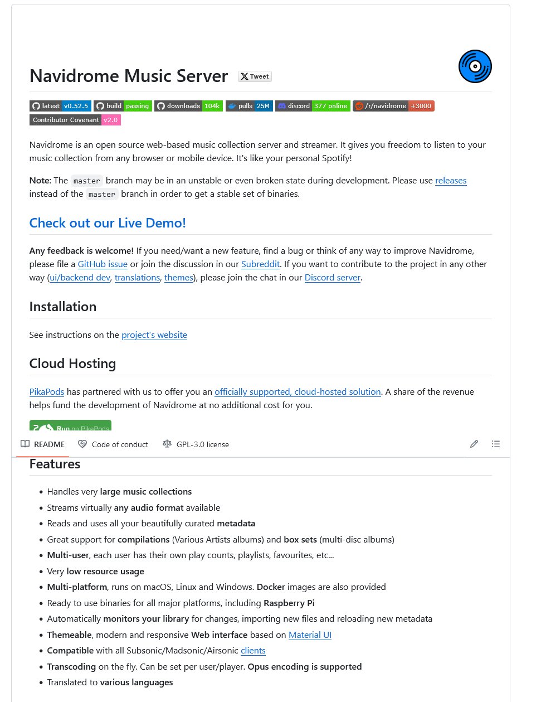

# Navidrome - open source web-based music collection server

Navidrome allows you to enjoy your music collection from anywhere, by making it available through a modern Web UI and through a wide range of third-party compatible mobile apps, for both iOS and Android devices.

Navidrome is open source software distributed free of charge under the terms of the GNU GPL v3 license

## Links 

<https://www.navidrome.org/>

<https://github.com/navidrome/navidrome>

<https://mialikescoffee.com/musicstreaming-mit-navidrome/>
