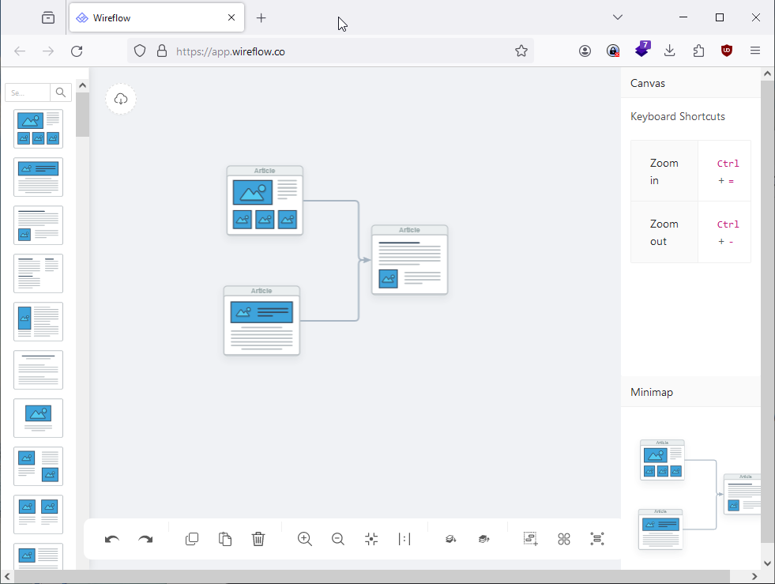
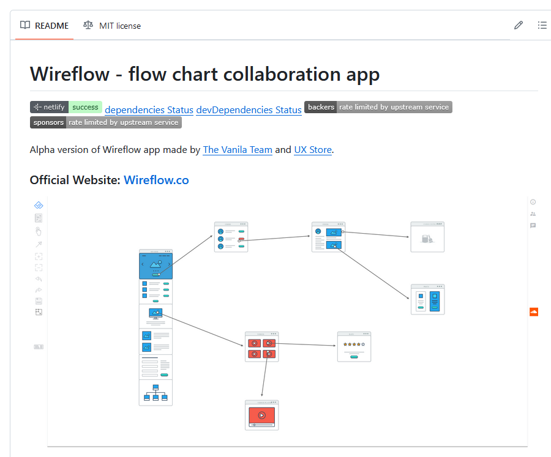
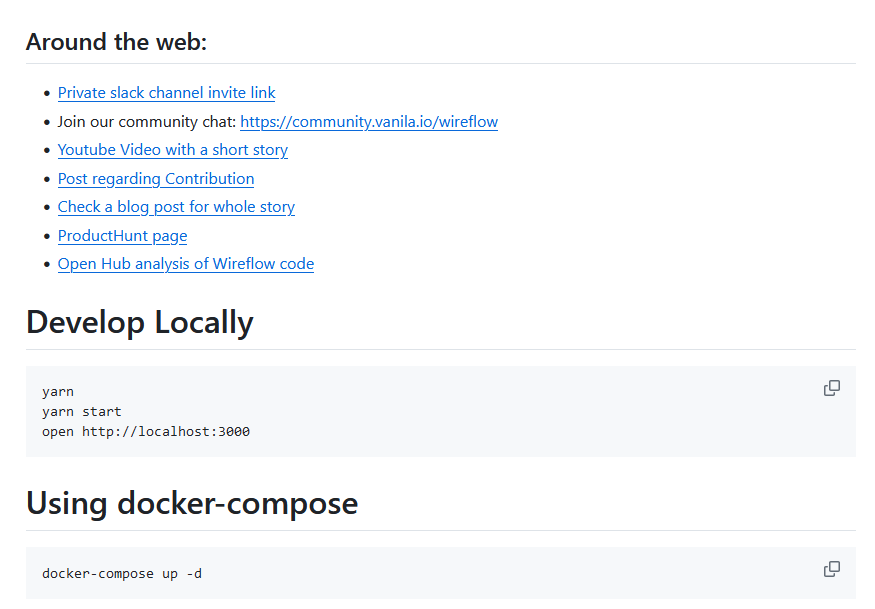
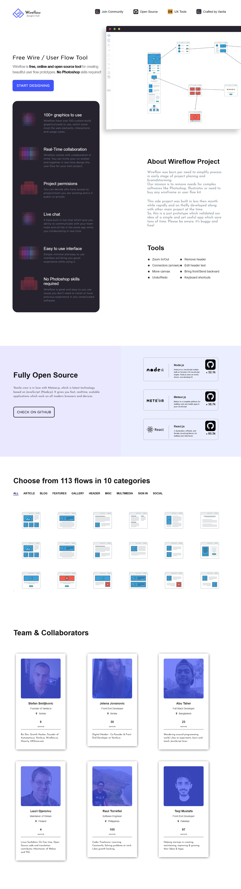

# Wireflow

Wireflow is free, online and open source tool for creating beautiful user flow prototypes. No 
# Photoshop skills required!

## Link

<https://github.com/vanila-io/wireflow>

<https://wireflow.co/>
