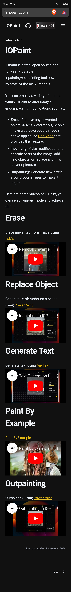
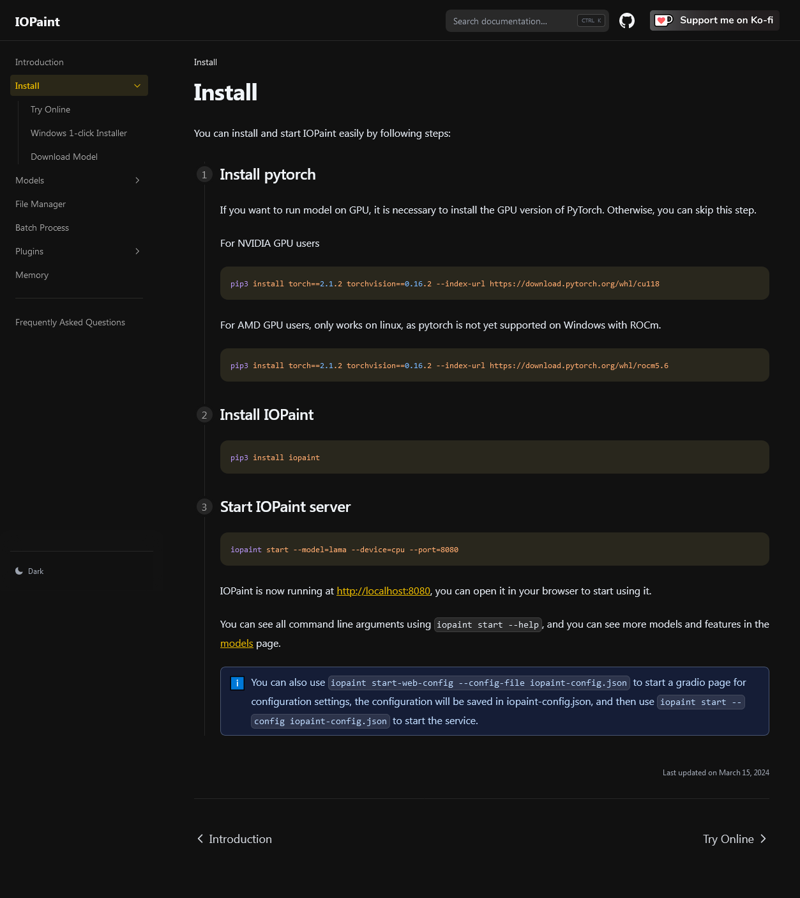
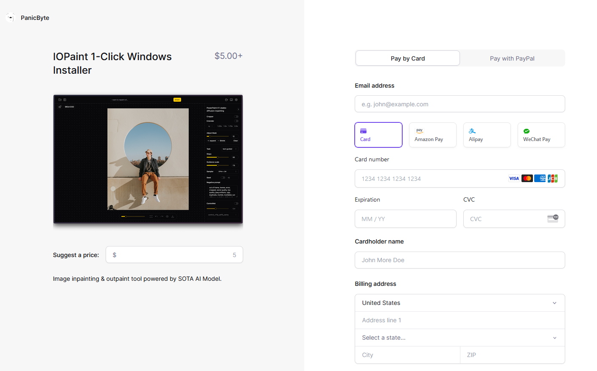

# IOPaint

**IOPaint** is a free, open-source and fully self-hostable inpainting/outpainting tool powered by state-of-the-art AI models.

You can employ a variety of models within IOPaint to alter images, encompassing modifications such as:

- **Erase**: Remove any unwanted object, defect, watermarks, people. I have also developed a macOS native app called [OptiClean (opens in a new tab)](https://opticlean.io/) that provides this feature.
- **Inpainting**: Make modifications to specific parts of the image, add new objects, or replace anything on your pictures.
- **Outpainting**: Generate new pixels around your images to make it larger.

Here are demo videos of IOPaint, you can select various models to achieve different:

## Link 

<https://www.iopaint.com/>

