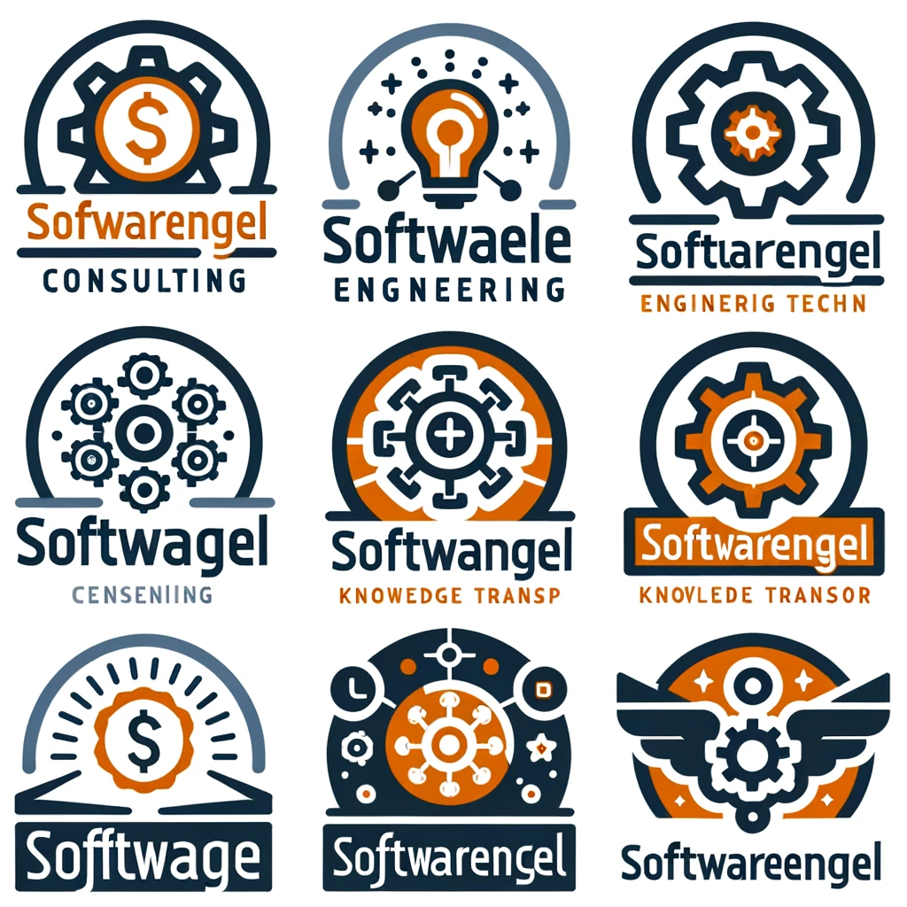
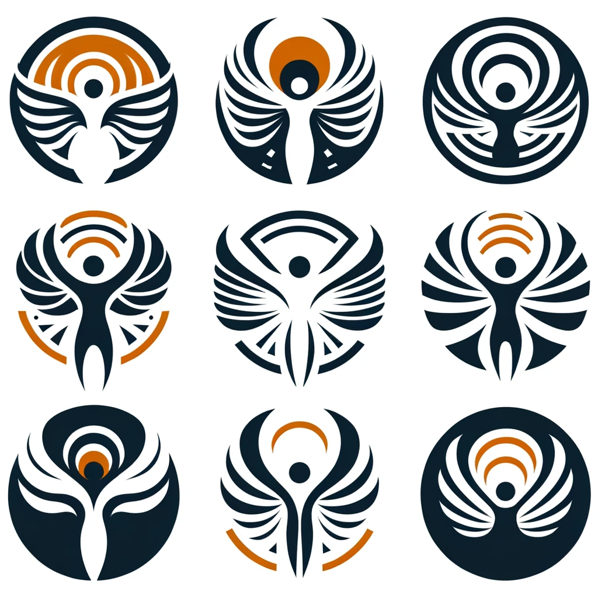

# Open AI Logo Creator 

## make a logo for software company for consulting and engineering teaching and devops and know how transfer

## dont show text 

## use only text:softwareengel

# Selbst mir ChatGPT 4

make a 9 logos for software company for consulting and engineering teaching and devops and know how transfer, serious logo it should be clean and simple , use orange and gray color palette

use the exact text "softwareengel"

