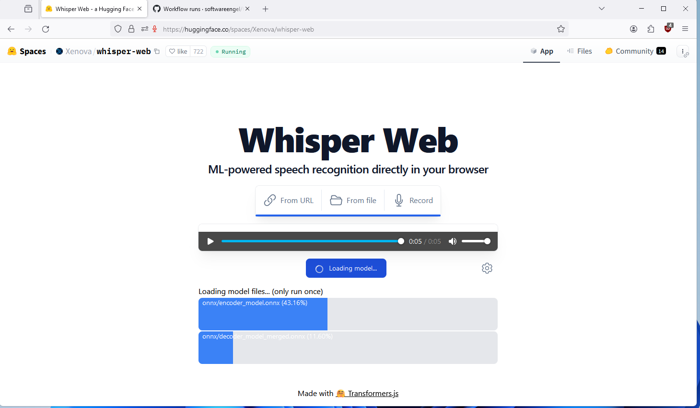

# transformer.js
<https://github.com/xenova/transformers.js?tab=readme-ov-file>

State-of-the-art Machine Learning for the web. Run 🤗 Transformers directly in your browser, with no need for a server!

Transformers.js is designed to be functionally equivalent to Hugging Face's [transformers](https://github.com/huggingface/transformers) python library, meaning you can run the same pretrained models using a very similar API. These models support common tasks in different modalities, such as:

- 📝 **Natural Language Processing**: text classification, named entity recognition, question answering, language modeling, summarization, translation, multiple choice, and text generation.
- 🖼️ **Computer Vision**: image classification, object detection, and segmentation.
- 🗣️ **Audio**: automatic speech recognition and audio classification.
- 🐙 **Multimodal**: zero-shot image classification.

Transformers.js uses [ONNX Runtime](https://onnxruntime.ai/) to run models in the browser. The best part about it, is that you can easily [convert](https://github.com/xenova/transformers.js?tab=readme-ov-file#convert-your-models-to-onnx) your pretrained PyTorch, TensorFlow, or JAX models to ONNX using [🤗 Optimum](https://github.com/huggingface/optimum#onnx--onnx-runtime).

For more information, check out the full [documentation](https://huggingface.co/docs/transformers.js).

## Beispiel

<figure class="video_container">
  <video id="myVideo" width="100%"  controls="true" allowfullscreen="true" autoplay poster="../_asset/2024-04-11-transformer.js_video_1.mp4">
    <source src="../_asset/2024-04-11-transformer.js_video_1.mp4" type="video/mp4">
  </video>
</figure>

