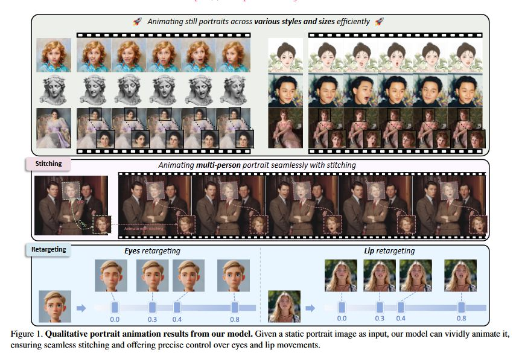

https://github.com/KwaiVGI/LivePortrait

This repo, named LivePortrait, contains the official PyTorch implementation of our paper LivePortrait: Efficient Portrait Animation with Stitching and Retargeting Control. We are actively updating and improving this repository. If you find any bugs or have suggestions, welcome to raise issues or submit pull requests (PR)

<https://liveportrait.github.io/>

<https://github.com/KwaiVGI/LivePortrait/blob/main/assets/docs/showcase2.gif>

https://raw.githubusercontent.com/KwaiVGI/LivePortrait/main/assets/docs/showcase2.gif
