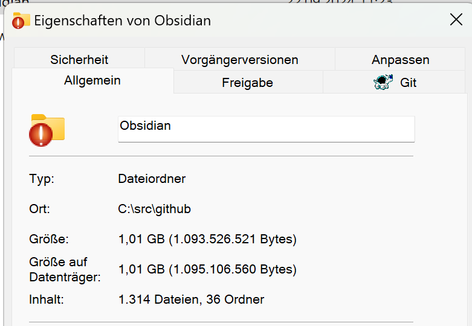
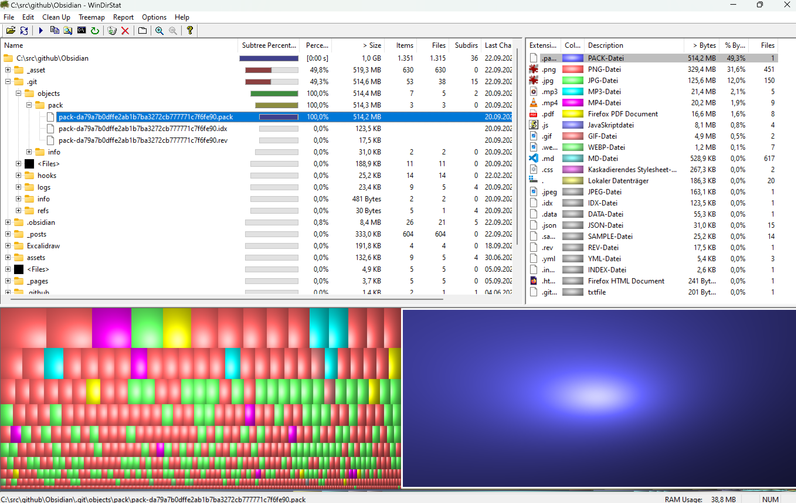
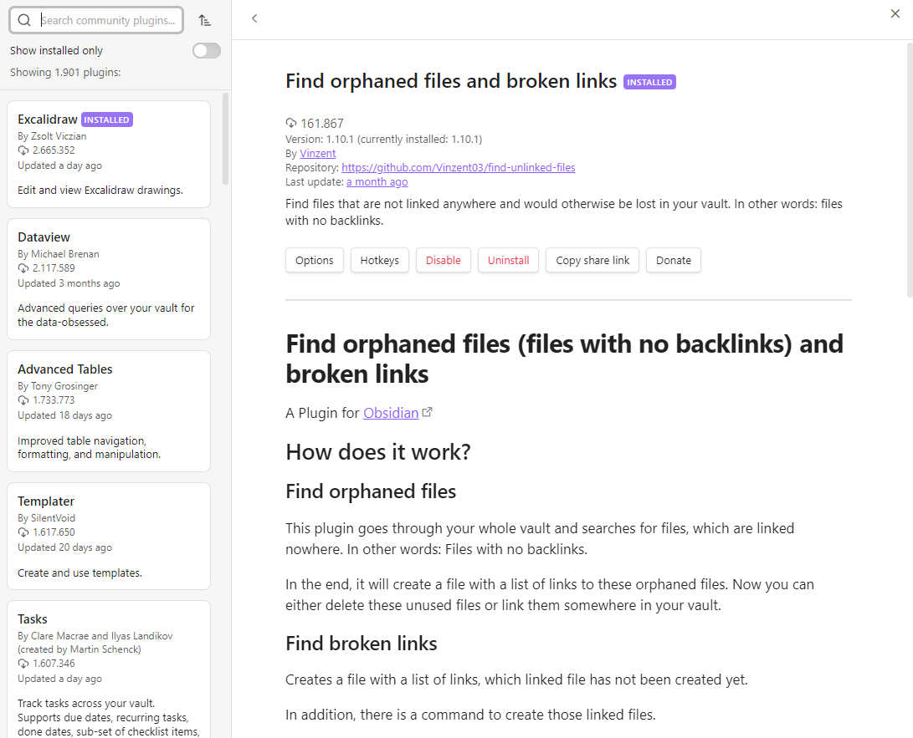
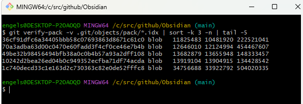
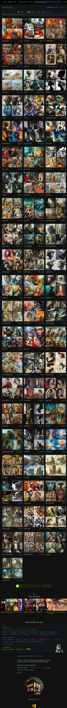

# shrink git repo for obsidian android phone usage 

## current state

## Analysis Files and Sites 

## Analysis Result

~ 50 % .pack Files 
~ 30 % PNG - Files 
~ 12 % JPG Files 

## .pack ?

## PNG - Shirinking 
TODO -> PNG -> JPG / Webp + rename all Links 

### 

jpg irfanview default, 80% quality

Beispiel 2

TODO Webp in Obsidian + git yekyll SSG Page 

