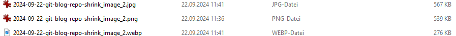
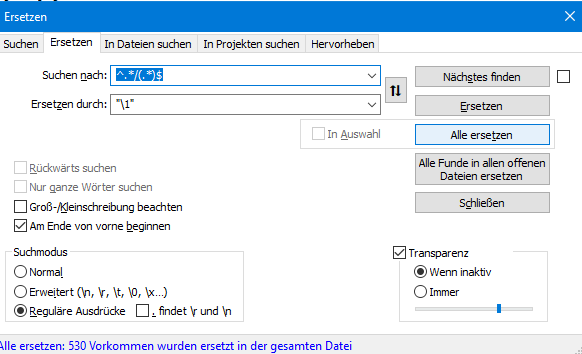
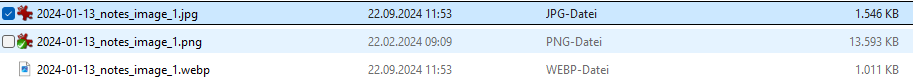

# shrink git repo for obsidian android phone usage - wipback


## current state


## Analysis Files and Sites 


## Analysis Result

~ 50 % .pack Files 
~ 30 % PNG - Files 
~ 12 % JPG Files 

## Shrink .pack ?

https://stackoverflow.com/questions/11050265/remove-large-pack-file-created-by-git
https://www.ducea.com/2012/02/07/howto-completely-remove-a-file-from-git-history/
```
git verify-pack -v .git/objects/pack/*.idx | sort -k 3 -n | tail -5
``` 


## PNG - Shirinking in JPG /  WEBP
TODO -> PNG -> JPG / Webp + rename all Links 


jpg irfanview default, 80% quality




Beispiel 2




### Problem Webp 


#### Finde relevant Files


## check Webp in Obsidian + git yekyll SSG Page - okay working 


## Results

- keine Dateien > 16383 Pixel Dim X or Y  für webp
- size webp < jpg 
- import as jpg / auto update PNG  
	- https://github.com/musug/obsidian-paste-png-to-jpeg 
	- https://gist.github.com/juanbretti/7f3dfc98b39e3d4216c275232a56305c